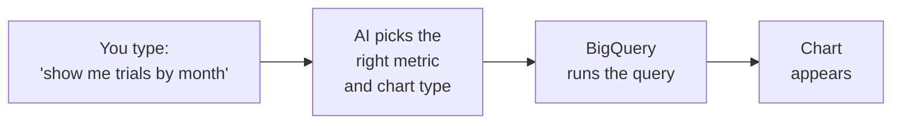
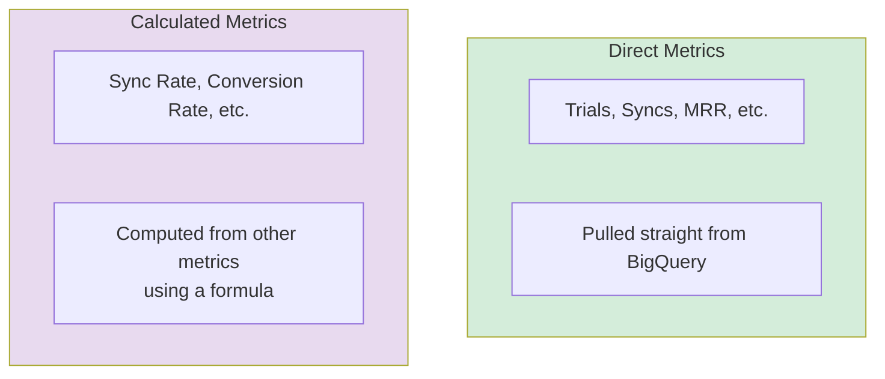
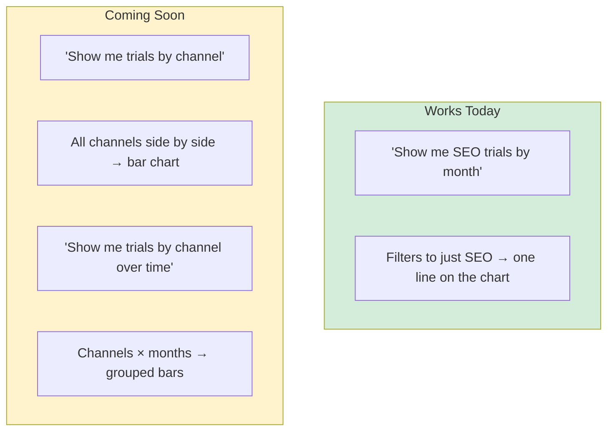
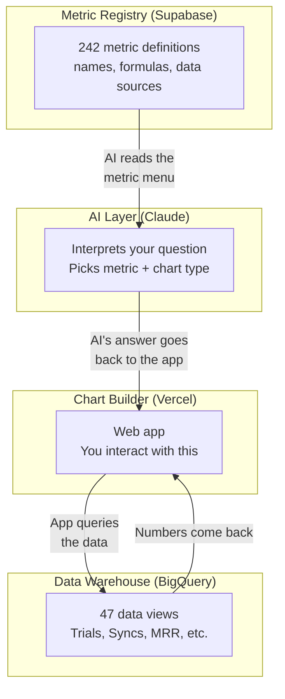

# AI Chart Builder — How It Works

## What Is This?

An internal tool where you type a question in plain English — like "show me trials by month" — and get an interactive chart back instantly. No SQL, no Looker, no asking someone to pull data.

## How It Works (30-Second Version)

1. **You ask a question** in the chart builder
2. **The AI figures out what you mean** — it picks the right metric (e.g., "Trials"), the right time range, and the right chart type
3. **BigQuery pulls the actual numbers** from our data warehouse
4. **The chart renders** in your browser

**The AI never sees your data.** It just reads a menu of available metrics and picks the right one. Think of it like a waiter — it takes your order and sends it to the kitchen, but it doesn't cook the food.

## Where Do Metrics Come From?

We maintain a registry of ~242 metrics in a database called Supabase. Each metric has:

- A **name** (e.g., "Trials", "Syncs", "MRR")
- A **data source** pointing to a BigQuery table
- Optionally, a **formula** (e.g., Sync Rate = Syncs / Trials)

When you open the chart builder, the AI loads this registry so it knows what's available. **If we add a new metric to the registry, the AI can immediately use it** — no code changes needed.

## Two Types of Metrics

- **Direct metrics** — the number lives in BigQuery. We just query it.
- **Calculated metrics** — there's no single table for "Sync Rate." Instead, we pull Syncs and Trials separately, then divide. The formula is stored in the metric registry.

## Filtering vs. Grouping

**Filtering** = "only show me one slice" (e.g., just SEO). Works today.

**Grouping** = "break it down by all slices" (e.g., SEO vs PPC vs Direct side by side). Being built now.

## What Updates Automatically?

| Change | Auto-updates? |
|--------|:---:|
| Someone changes how "Trials" is defined in BigQuery | Yes — next chart load |
| Someone changes a formula in the metric registry | Yes — next page refresh |
| Someone adds a new metric to the registry | Yes — AI sees it immediately |
| Saved dashboard charts when underlying data changes | No — must re-save (known gap, fix planned) |

No deploys needed for metric or definition changes. Everything is pulled live.

## System Overview

**Four systems, one job each:**

| System | Job |
|--------|-----|
| **Supabase** | Stores the list of metrics and their definitions |
| **AI (Claude)** | Understands your question and picks the right metric |
| **BigQuery** | Holds all the actual data and answers queries |
| **Vercel** | The web app you see and interact with |
