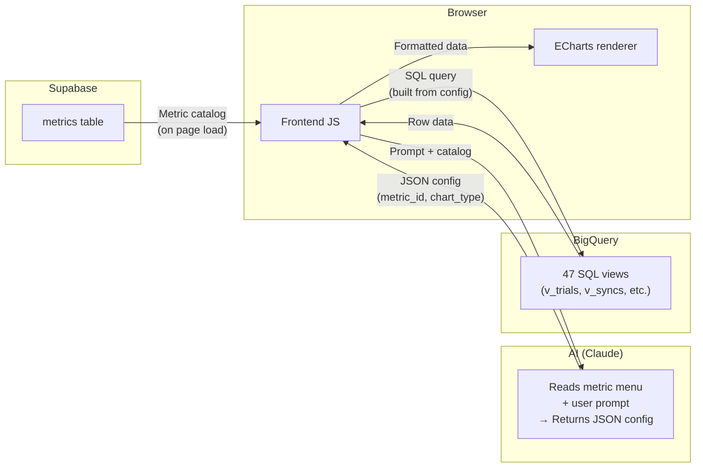
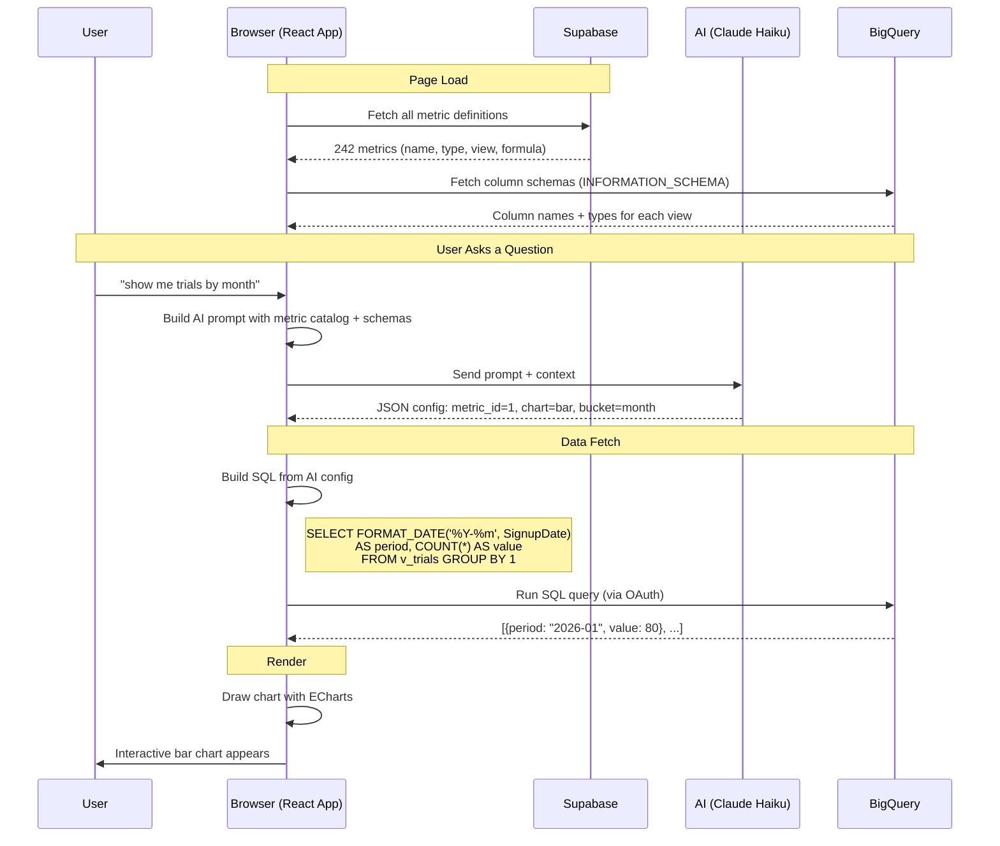
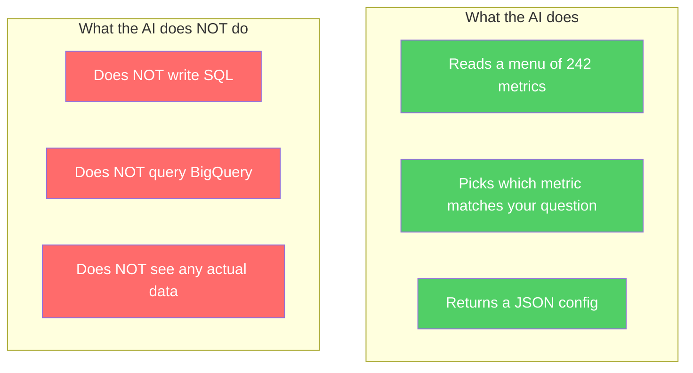
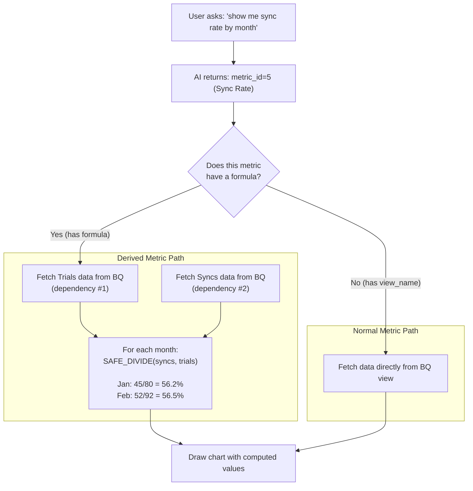
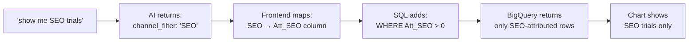
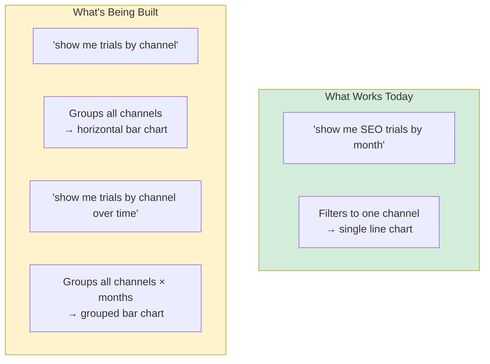
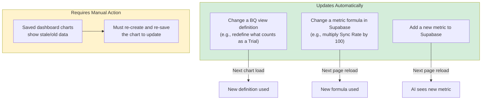
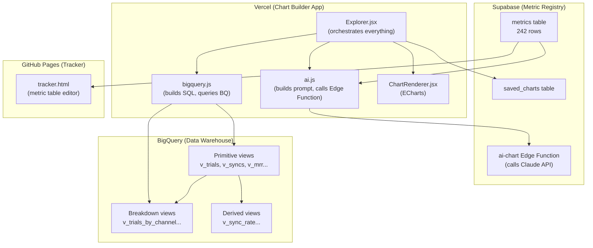

# AI Chart Builder — How It Works

## The Big Picture

The chart builder has 4 moving parts. Each one does exactly one job:

| System | What it stores | Role |
|--------|---------------|------|
| **Supabase** | Metric definitions (names, formulas, which BQ view to query) | The "menu" the AI reads from |
| **AI (Claude)** | Nothing — stateless | Reads the menu + your prompt, picks the right metric and chart type |
| **BigQuery** | All the actual data (signups, syncs, revenue, etc.) | Answers SQL queries with real numbers |
| **Browser** | Nothing persistent | Builds the SQL, runs it, draws the chart |



## The Full Flow: Prompt to Chart

Here's exactly what happens when someone types **"show me trials by month"**:



## Key Concept: The AI Does NOT Touch Data

This is the most important thing to understand:



**The AI is a router.** It reads the question, looks at the metric catalog, and says: *"You want metric #1 (Trials), grouped by month, as a bar chart."* Then the browser's JavaScript builds the actual SQL query and runs it against BigQuery.

## How the AI's "Menu" Works

The `metrics` table in Supabase looks like this:

| id | name | metric_type | view_name | formula | depends_on |
|----|------|-------------|-----------|---------|------------|
| 1 | Trials | primitive | v_trials | — | — |
| 2 | Syncs | primitive | v_syncs | — | — |
| 5 | Sync Rate | derived | — | SAFE_DIVIDE({2},{1}) | [2, 1] |
| 10 | MRR | foundational | v_mrr | — | — |

Before calling the AI, the app formats this into plain text:

```
- id:1  name:"Trials"     type:primitive  view:v_trials
- id:2  name:"Syncs"      type:primitive  view:v_syncs
- id:5  name:"Sync Rate"  type:derived    formula:SAFE_DIVIDE({2},{1})  depends:[2,1]
- id:10 name:"MRR"        type:foundational  view:v_mrr
```

This text gets stuffed into the AI's prompt alongside the user's question. That's how the AI knows what metrics exist.

## What the AI Returns

The AI returns a small JSON object — a "chart spec." Example:

```json
{
  "metric_ids": [1],
  "data_config": {
    "x_field": "SignupDate",
    "y_fields": ["COUNT"],
    "time_bucket": "month",
    "channel_filter": null,
    "labels": ["Trials"]
  },
  "echarts_type": "bar",
  "explanation": "Monthly count of new trials"
}
```

This says: *Use metric #1 (Trials). Count the rows. Group by month. Draw a bar chart.*

The frontend JavaScript then translates this into an actual SQL query:

```sql
SELECT FORMAT_DATE('%Y-%m', SignupDate) AS period,
       COUNT(*) AS value
FROM `project-for-method-dw.revenue.v_trials`
GROUP BY 1
ORDER BY 1
```

## How Derived Metrics Work (e.g., Sync Rate)

Some metrics aren't stored in BigQuery — they're calculated from other metrics. "Sync Rate" = Syncs / Trials.



The formula `SAFE_DIVIDE({2},{1})` means "divide metric #2 by metric #1." The `{2}` and `{1}` are replaced with the actual values fetched from BigQuery.

This computation happens **in the browser**, not in BigQuery. The formulas are stored in the Supabase `metrics` table.

## Filtering and Grouping (Dimensions)

There are two ways to slice data beyond just "metric over time":

### Channel Filtering — "show me SEO trials by month"

This is **fully built.** Each row in BigQuery has attribution columns like `Att_SEO`, `Att_Pay_Per_Click`, `Att_Organic`, etc. When the AI detects a channel in the prompt, it returns `channel_filter: "SEO"`. The frontend maps that to the right column and adds a `WHERE Att_SEO > 0` clause to the SQL query.



The mapping between channel names and BigQuery columns lives in `ATT_COL_MAP` (in `chartUtils.js`):

| Channel name | BigQuery column |
|-------------|----------------|
| SEO | Att_SEO |
| PPC | Att_Pay_Per_Click |
| Organic | Att_Organic |
| Direct | Att_Direct |
| Referral | Att_Referral |
| Partner | Att_Partner |

### Group-By Dimensions — "show me trials by channel"

This is **not built yet** in the new AI builder (but works in the old `charts.html`).

The difference from filtering: filtering says "only show SEO." Grouping says "show all channels side by side." That requires a different chart type (grouped bar or horizontal bar) and pivoting the data into multiple series.



**What needs to happen:**
1. AI needs to return a `group_by_field` in its config (e.g., `"channel"` or `"country"`)
2. The SQL query needs a `GROUP BY` on that dimension
3. The chart renderer needs to pivot data into one series per group value
4. Each group gets its own color and a legend appears

This is **P0 item #3** in the feature parity plan.

## What Happens When Data Changes?



**No deploy needed** for metric or view changes. Both Supabase and BigQuery are queried live at runtime. The only exception is saved dashboards — those store a snapshot of the data at save time and don't refresh.

## System Map



## Glossary

| Term | What it means |
|------|--------------|
| **Primitive metric** | A metric that comes directly from a BigQuery view (e.g., Trials = count of rows in `v_trials`) |
| **Derived metric** | A metric calculated from other metrics using a formula (e.g., Sync Rate = Syncs / Trials) |
| **BQ view** | A saved SQL query in BigQuery that acts like a virtual table. Change the query, all charts using it update automatically. |
| **Supabase** | A hosted database (like a spreadsheet in the cloud) that stores our metric definitions — names, formulas, which BQ view to use |
| **Edge Function** | A small program that runs on Supabase's servers. Ours calls the AI (Claude) and returns the result. |
| **ECharts** | The JavaScript library that draws interactive charts in the browser |
| **Chart spec** | The JSON object the AI returns — describes what to chart but doesn't contain any data |
| **OAuth** | The "Sign in with Google" flow that lets the browser query BigQuery directly using your Google account |
