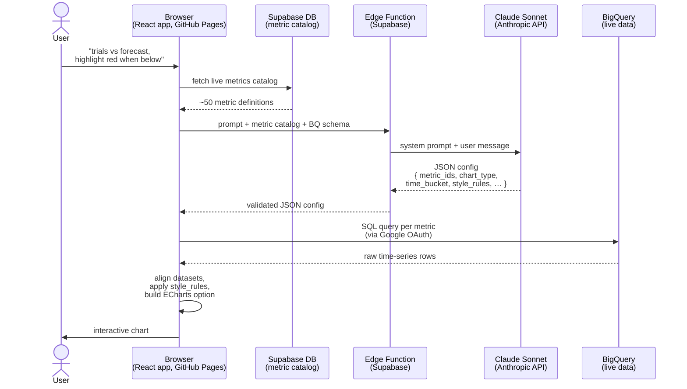

# AI Chart Builder — Architecture Overview

## Request Flow



## What Claude Controls (JSON config)

Claude never writes SQL or touches data. It returns a config that the frontend executes:

```json
{
  "metric_ids": [54, 271],
  "echarts_type": "bar",
  "data_config": {
    "time_bucket": "month",
    "last_n_months": 12,
    "labels": ["Trials", "Trials Forecast"],
    "style_rules": [
      { "target": "Trials", "compareTo": "Trials Forecast", "operator": "<", "color": "#ef4444" }
    ]
  }
}
```

The frontend validates this config, queries BigQuery, and renders the result.

## Stack

| Layer | Technology |
|---|---|
| Frontend | React + Vite, deployed to GitHub Pages |
| AI proxy | Supabase Edge Function (Deno) |
| LLM | Claude Sonnet 4.5 (Anthropic API) |
| Metric catalog | Supabase Postgres |
| Data | BigQuery (`project-for-method-dw.revenue.*`) |
| Charts | Apache ECharts |

## Key Architectural Decisions

**BigQuery queried directly from the browser**
The frontend authenticates with Google OAuth and runs SQL against BigQuery directly — no backend in the data path. This keeps latency low and removes a server to maintain, but means every user needs a Google account with BQ access.

**Edge Function is a thin proxy only**
The Edge Function's sole job is to hold the Anthropic API key server-side. It forwards the prompt and metric catalog to Claude and returns the JSON config. It does no data access.

**Metric catalog drives everything**
All ~50 live metrics are stored in Supabase with their BQ view names, formulas, and notes. Claude receives this catalog on every request — adding a new metric to Supabase is all that's needed to make it available to the AI.

**SQL is generated at query time, not stored**
The frontend builds SQL dynamically from the metric's `view_name` and the AI's config (time bucket, filters, etc.). Some metrics with complex aggregations have a `chart_sql` field that overrides this with a pre-written query.

## Known Tradeoffs

- **No backend auth layer on BQ** — any user with a Google account in the org can query BigQuery directly from the browser
- **AI non-determinism** — optional fields like `style_rules` are returned inconsistently by smaller models; mitigated by moving to Sonnet and by applying forecast coloring deterministically on the frontend
- **Schema loaded at runtime** — BQ column schemas are fetched on page load via `INFORMATION_SCHEMA`; adds ~1s of latency on first chart after login
